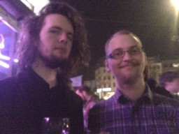

Title: A MAZE 2015
author: mrwonko
date: 2015-06-11 12:30
tags: A MAZE, Berlin, Meltdown
category: Other
type: blog
summary: I went to A MAZE again.

I should have written this post earlier. It has been almost two months since I went to [A MAZE. / Berlin](http://amaze-berlin.de/) so I don't remember all the details. Here's hoping I still remember the highlights.

I'll not go into detail on what A MAZE is again, it's basically an Indie GameDev Conference with exhibitions and parties. This was the 4th one in Berlin, and the 3rd one I attended after missing the first one.

I met a bunch of people I already knew from previous years; when I arrived on Wednesday evening [Major Bueno](https://twitter.com/ThatMajorBueno/) were among the first I saw. I was somewhat self-conscious about my new hat, fearing I might be labelled a Hipster and hated. But as if he could read my thoughts the first thing [Majus](https://twitter.com/MajusArts) said was that he liked it, making me feel a lot more confident. Go Majus!

[Sos](https://twitter.com/Sosowski) was also there and introduced me to [Aubrey](https://twitter.com/aubreyserr) from Wolfire; I knew of him but had never met him before. He came all the way from San Francisco.

  
Aubrey and me.

I had also searched for nearby e-sports bars. I had never been to one but felt like I'd enjoy it, having previously read about the [Loading Bar](http://www.drinkrelaxplay.co.uk/) in London with its awesome punny cocktail names like the Evil with Gin and Assassin's Mead. And I had found one within walking distance of A MAZE (if you're willing to walk for a while), the [Meltdown Berlin](http://www.meltdown.bar/berlin/). So that's where I went on Wednesday night.

It would have been better to go on Tuesday, when Dota 2 is on, but I only arrived on Wednesday afternoon so that was out of the question. So Wednesday it was. That's when the Hearthstone tournament is on. I don't play Hearthstone so I didn't really follow it, instead I chatted with the people there, mostly the staff, and perused the drinks. I quite enjoyed them, although they were out of milk and cream. I could easily see myself going there regularly, especially on Dota nights, if I lived there.

  
The TLO, lit and ready to serve.

Back at A MAZE it was business as usual: Interesting talks and cool people. Including a couple of what you might call indie celebrities:

  
Sos, [Dennis Wedin](https://twitter.com/dpunktw/), [MsMinotaur](https://twitter.com/MsMinotaur/) and [C418](https://twitter.com/C418)

It's amazing how much Dennis Wedin changed - when I met him a couple of years ago at Gamescom (showing Hotline Miami) he had no beard and shorter, brighter hair; I only recognized him due to the Keyboard Drumset Fucking Werewolf tattoo.

The two selfies I took reminded me how horrible my phone's front camera is; I'm generally not too happy with it, maybe I shouldn't have gone for a cheap model when I bought it 2 years ago. Oh well, it will have to do for another couple of months until I'm done with uni, have a job and can afford a new one. Anyway, selfie time:

  
Sos and me.

  
[Nina Freeman](https://twitter.com/hentaiphd) and me.

And while the back camera isn't quite as bad it still doesn't quite hold up, especially in low light conditions:

  
[William Pugh](https://twitter.com/HonestWilliam) and me.

So that was A MAZE. Fun as always, great people, good weather, interesting talks. Looking forward to next year.

So long  
Willi
